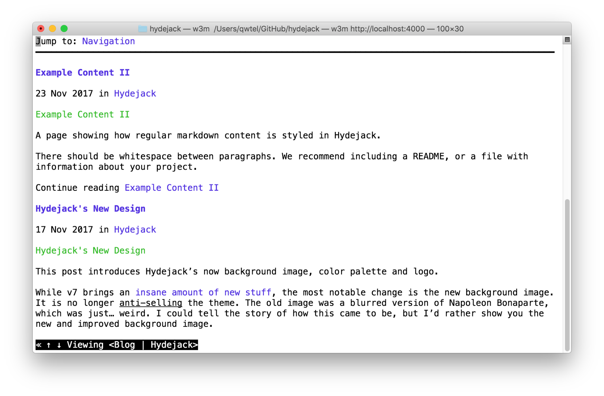

# About

<!--author-->
1. this list will be replaced by the toc
{:toc .large-only}

+ 이름 : 윤인선
+ 생년월일 : 1998. 09. 25.
+ 거주지 : 서울 중랑구 / 강원도 춘천
+ 소속 : 한림대학교 정보과학대학 소프트웨어학부 빅데이터 전공 (부전공 : 콘텐츠IT) 2023. 02. 졸업예정 
+ email : yuninseon@hallym.ac.kr
+ Github : [github.com/inseonyun](https://github.com/inseonyun)

## 경력 & 경험
+ [ 2022. 01. ~ ing ] 삼성메디슨 현장실습
+ [ 2021. 12. ] 한림대학교 SW중심사업단 주관 캡스톤디자인 경연대회 금상
+ [ 2021. 11. ] 한림대학교 SW중심사업단 주관 2021 SW Coding Festival 참여

## 선호 언어
+ C# ( . NET )
+ C++
+ JAVA (Android)

## 관심사
+ Window Programming
+ Mobile (Android) Programming
+ Kotlin

## 취득 자격증
+ MOS Master
+ 워드프로세서
+ 컴퓨터활용능력 1급

## 주요 수강 현황

|학기|구분|과목|학점|
|:---:|:---:|:---|:---:|
|2021-2|공통전선|빅데이터캡스톤디자인|3|
|2021-2|공통전선|모바일프로그래밍|3|
|2021-2|공통전선|머신러닝|3|
|2021-2|공통전선|빅데이터개론|3|
|2021-1|공통전선|윈도우프로그래밍|3|
|2021-1|공통전선|컴퓨터그래픽스|3|
|2021-1|공통전선|운영체제|3|
|2021-1|공통전선|정보보호론|3|
|2020-2|공통전선|데이터베이스|3|
|2020-2|공통전선|알고리즘|3|

## 주요 활동


<!-- ## Hydejack

A boutique Jekyll theme for hackers, nerds, and academics.  
{:.lead}

1. this list will be replaced by the toc
{:toc .large-only}

{:.lead width="1920" height="1080" loading="lazy"}

Hydejack's cover page on a variety of screen sizes.
{:.figcaption}


**Hydejack** is a boutique Jekyll theme for hackers, nerds, and academics, with a focus on personal sites that are meant to impress. 

It includes a blog that is suitable for both prose and technical documentation, a portfolio to showcase your projects, and a resume template that looks amazing on the web and in print.

> Your complete presence on the web — A [blog], [portfolio], and [resume].
{:.lead}


## A Personal Site That Won't Disappear

**Hydejack** is 100% built on Open Source software, and is Open Source itself, save for parts of the PRO version. The PRO version is a one-time payment that gives you the right to use it forever.

Hydejack is all static sites. _HTML_. All you need is a web server --- any web server --- to have a professional web presence that lasts a lifetime.

## Download




## A Free Blogging Theme
**Hydejack** started out as a free blogging theme for Jekyll — and continues to be so. -->

<!--posts-->


<!-- ## An Impressive Portfolio
A portfolio that's guaranteed to be impressive — no matter what you put into it. -->

<!--projects-->


<!-- ## A Printable Resume
Get a resume that's consistent across the board — whether it's on the web, mobile, print, or [PDF](assets/Resume.pdf).

[{:.lead width="884" height="632" loading="lazy"}][resume]{:.no-hover.no-mark}

Front and center page of a print resume generated by Hydejack.
{:.figcaption} -->


<!-- ## Just Markdown
Write all content with Markdown. __Hydejack__ gives you [additional CSS classes](docs/writing.md) to stylize your content, without losing compatibility with other Jekyll themes.


## Just Markup
**Hydejack** boasts a plethora of modern JavaScript, but make no mistake: It's still a _plain old web page_ at its core. It works without JavaScript and you can even view it in a text-based browser like `w3m`:

{:.tail width="1920" height="1260" loading="lazy"}

The Hydejack blog, as seen by the text browser `w3m`.
{:.figcaption}


## Syntax Highlighting
**Hydejack** features syntax highlighting, powered by [Rouge].

```html -->
<!-- file: `_includes/my-body.html` -->
<!-- <script type="module">
  document.querySelector("hy-push-state").addEventListener("hy-push-state-load", () => {
    const supportsCodeHighlights = false; // TBD!!
  });
</script>
``` -->
<!-- 
Code blocks can have a filename and a caption.
{:.figcaption}


## Beautiful Math
They say math is beautiful — and with **Hydejack**'s [math support][math] it's guaranteed to also look beautiful:

$$
\begin{aligned}
  \phi(x,y) &= \phi \left(\sum_{i=1}^n x_ie_i, \sum_{j=1}^n y_je_j \right) \\[2em]
            &= \sum_{i=1}^n \sum_{j=1}^n x_i y_j \phi(e_i, e_j)            \\[2em]
            &= (x_1, \ldots, x_n)
               \left(\begin{array}{ccc}
                 \phi(e_1, e_1)  & \cdots & \phi(e_1, e_n) \\
                 \vdots          & \ddots & \vdots         \\
                 \phi(e_n, e_1)  & \cdots & \phi(e_n, e_n)
               \end{array}\right)
               \left(\begin{array}{c}
                 y_1    \\
                 \vdots \\
                 y_n
               \end{array}\right)
\end{aligned}
$$

Hydejack uses KaTeX to efficiently render math.
{:.figcaption}


## Build an Audience
The PRO version has built-in support for customizable [Tinyletter] newsletter subscription boxes.

If you are using a different service like MailChimp, you can build a custom newsletter subscription box using [Custom Forms][forms].


## Features




## Comparison




## Get It Now

Use the the form below to purchase Hydejack PRO:

<div class="gumroad-product-embed" data-gumroad-product-id="nuOluY"><a href="https://gumroad.com/l/nuOluY">Loading…</a></div> -->

<!-- 
[blog]: /
[portfolio]: https://hydejack.com/examples/
[resume]: https://hydejack.com/resume/
[download]: https://hydejack.com/download/
[welcome]: https://hydejack.com/
[forms]: https://hydejack.com/forms-by-example/

[features]: #features
[news]: #build-an-audience
[syntax]: syntax-highlighting
[latex]: #beautiful-math
[dark]: https://hydejack.com/blog/hydejack/2018-09-01-introducing-dark-mode/
[search]: https://hydejack.com/#_search-input
[grid]: https://hydejack.com/blog/hydejack/

[lic]: LICENSE.md
[pro]: licenses/PRO.md
[docs]: docs/README.md
[ofln]: docs/advanced.md#enabling-offline-support
[math]: docs/writing.md#adding-math

[kit]: https://github.com/hydecorp/hydejack-starter-kit/releases
[src]: https://github.com/hydecorp/hydejack
[gem]: https://rubygems.org/gems/jekyll-theme-hydejack
[buy]: https://gum.co/nuOluY

[gpss]: https://developers.google.com/speed/pagespeed/insights/?url=https%3A%2F%2Fhydejack.com%2Fdocs%2F
[rouge]: http://rouge.jneen.net
[katex]: https://khan.github.io/KaTeX/
[mathjax]: https://www.mathjax.org/
[tinyletter]: https://tinyletter.com/ -->
